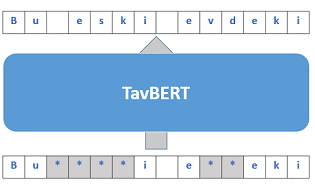

# TavBERT

A masked language model (MLM) over character spans for morphologically-rich languages.

Based on [Fairseq](https://github.com/pytorch/fairseq)'s  implementation of RoBERTa (Liu et al., 2019).

  

## Pre-Training

We train BERT-base models for Hebrew, Arabic, and Turkish, using the [OSCAR](https://oscar-corpus.com/) corpus (Ortiz
Suárez et al., 2019). Corpus' statistics for these languages can be found below:

Language | Hebrew | Arabic | Turkish
:---: | :---: | :---: | :---: 
#Sentences | ~20M | ~66M | ~78M

The model checkpoints are available at the Hugging Face hub: [Hebrew](https://huggingface.co/tau/tavbert-he), [Turkish](https://huggingface.co/tau/tavbert-tr), and [Arabic](https://huggingface.co/tau/tavbert-ar)

## Fine-Tuning

TavBERT is fine-tuned on part-of-speech (POS) tagging, morphological analysis, and named entity recognition (NER). 
